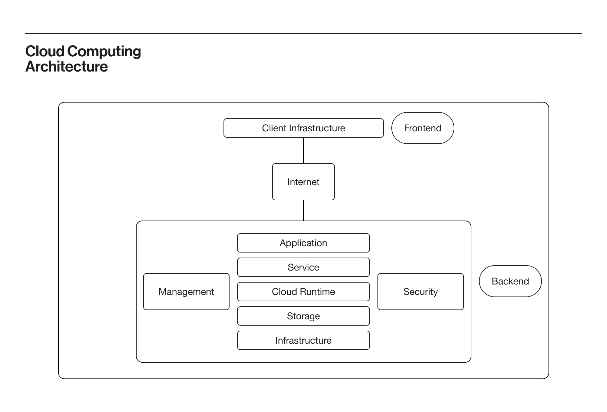
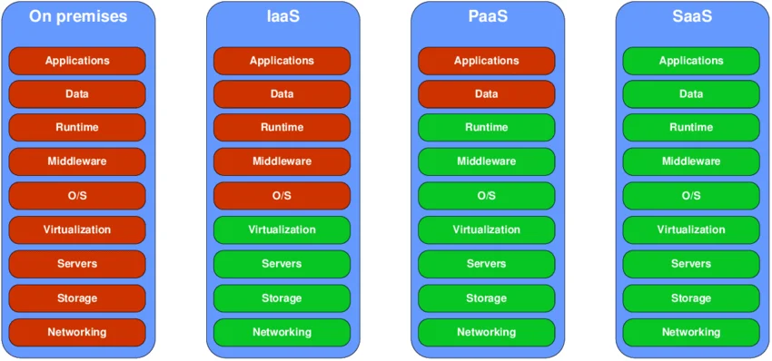
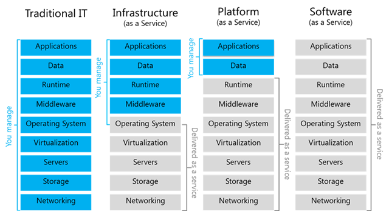
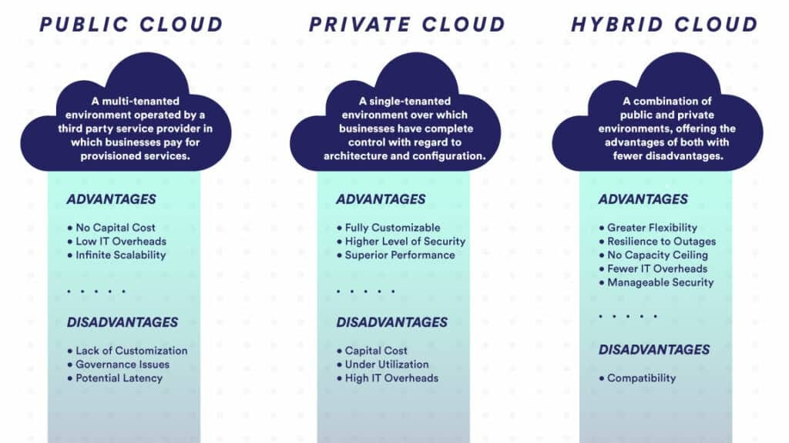
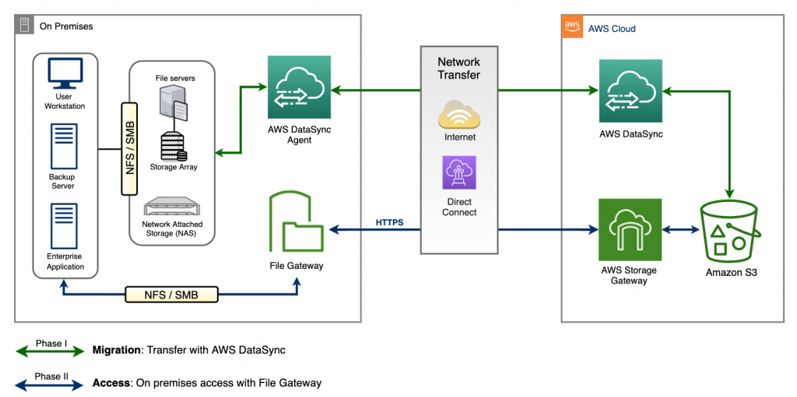
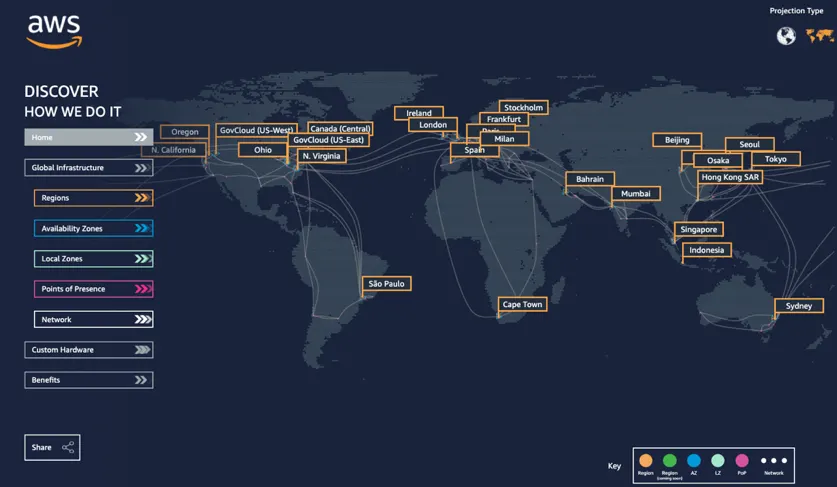
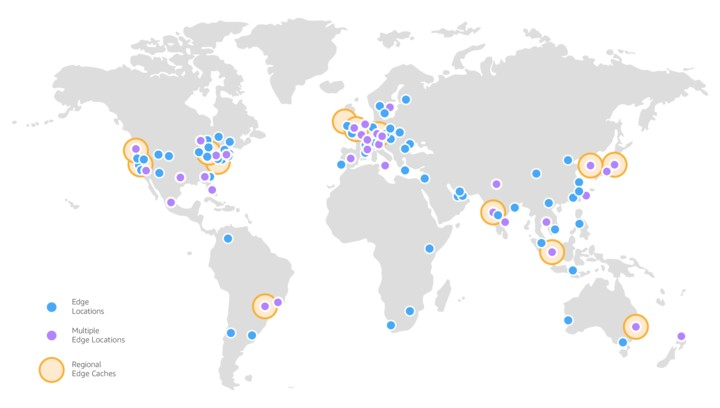
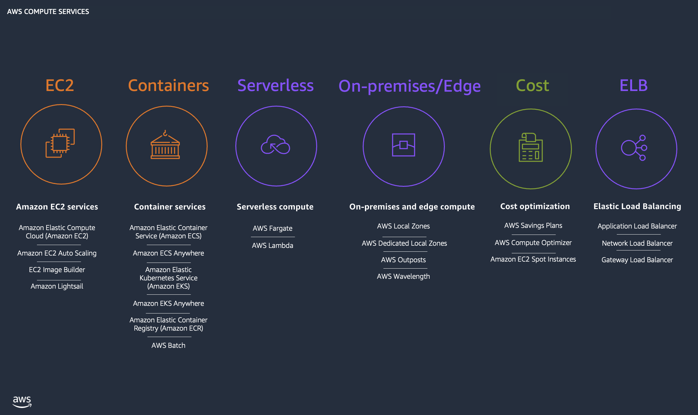
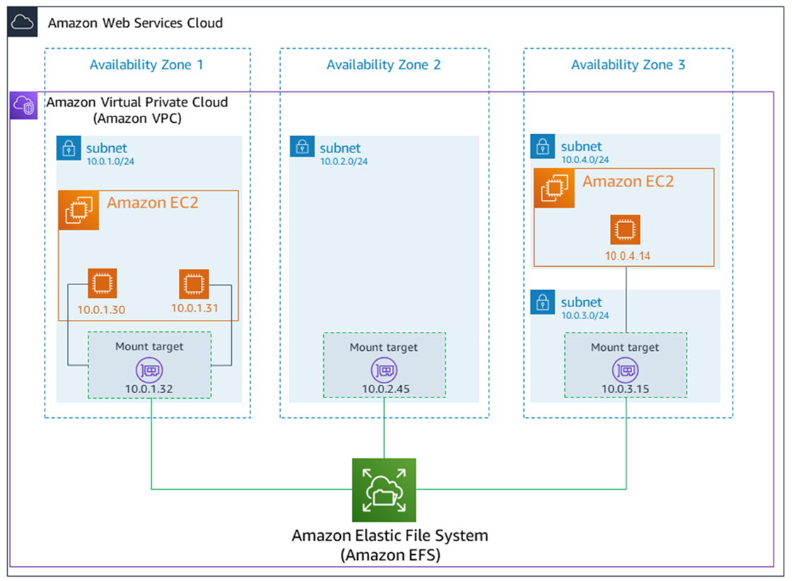

# Cloud Computing


## Introduction To Cloud
### 📌 Simple Definition
**Cloud computing** means:

👉 Delivering computing services (servers, storage, databases, networking, software) over the internet — instead of using your own physical hardware.

### 🧠 In One Line 
> **Cloud = Rent IT resources instead of buying them**

### 🏢 Traditional vs ☁️ Cloud
| Traditional (On-Premise) | Cloud Computing             |
| ------------------------ | --------------------------- |
| Buy servers 💰           | Rent servers 💡             |
| Maintain hardware 🔧     | Managed by provider         |
| Fixed capacity           | Scalable (increase anytime) |
| High upfront cost        | Pay-as-you-go               |

### ⚙️ Example 

👉 Without Cloud:

* You buy a server
* Install OS, database, app
* Maintain everything

👉 With Amazon Web Services:

* Launch server in minutes (EC2)
* Store data easily (S3)
* Use database (RDS)
* Pay only for usage


# ☁️ Types of Cloud Computing: IaaS, PaaS, SaaS

---

## 🧱 1. IaaS (Infrastructure as a Service)

### 📌 Definition
You get **virtual machines, storage, networking** — and you manage everything else.

### 🧠 Simple Meaning
> 👉 “You rent a computer and control it fully”

### ✅ You Manage:
* OS (Linux/Windows)
* Applications
* Runtime, data

### ✅ Cloud Provider Manages:
* Hardware
* Networking
* Data centers

### 🔧 AWS Example
* EC2 (Elastic Compute Cloud)

### 🎯 Real-Life Analogy
👉 Renting an empty house 🏠
You bring furniture, do setup, maintain inside.

## 🧱 2. PaaS (Platform as a Service)

### 📌 Definition
You get a **ready platform to build and run applications**.

### 🧠 Simple Meaning
> 👉 “You focus on coding, platform is ready”

### ✅ You Manage:
* Application code
* Data

### ✅ Cloud Provider Manages:
* OS
* Runtime
* Servers
* Scaling

### 🔧 AWS Example
* Elastic Beanstalk

### 🎯 Real-Life Analogy
👉 Renting a fully furnished house 🛋️
Just move in and start using.

## 🧱 3. SaaS (Software as a Service)

### 📌 Definition
You use software directly via internet — no setup required.

### 🧠 Simple Meaning
> 👉 “Just use the software”

### ✅ You Manage:
* Nothing (just usage)

### ✅ Provider Manages:
* Everything

### 🔧 Examples
* Gmail
* Zoom
* Microsoft 365


## 📊 Quick Comparison Table

| Feature      | IaaS | PaaS      | SaaS  |
| ------------ | ---- | --------- | ----- |
| Control      | High | Medium    | Low   |
| Setup Effort | High | Medium    | Low   |
| Flexibility  | High | Medium    | Low   |
| Example      | EC2  | Beanstalk | Gmail |

## 🧠 Easy Memory Trick
* 👉 **IaaS → “I control everything”**
* 👉 **PaaS → “Platform handles setup”**
* 👉 **SaaS → “Software ready to use”**


# ☁️ Cloud Deployment Models (Public, Private, Hybrid)


## 🌍 1. Public Cloud
### 📌 Definition
Infrastructure is **owned and managed by a cloud provider** and shared among multiple customers over the internet.

### 🧠 Simple Meaning
> 👉 “Cloud is open to everyone (pay and use)”

### 🏢 Providers
* Amazon Web Services
* Microsoft Azure
* Google Cloud

### ✅ Characteristics
* Multi-tenant (shared infrastructure)
* Pay-as-you-go pricing 💰
* Highly scalable 📈
* Accessible over internet 🌐

### ✅ Advantages
✔️ No hardware cost
✔️ Quick setup (minutes)
✔️ Global availability
✔️ High scalability

### ❌ Disadvantages
❌ Less control over infrastructure
❌ Shared environment (security concerns if misconfigured)

### 🔧 Examples
* Hosting websites on AWS EC2
* Storing files in S3
* Running apps on cloud servers

### 🎯 Real-Life Analogy
👉 Using a **public bus** 🚌
* Shared with others
* Pay per use
* No ownership

## 🔒 2. Private Cloud

### 📌 Definition
Cloud infrastructure is **used by only one organization** (not shared with others).

### 🧠 Simple Meaning
> 👉 “Cloud dedicated only for your company”

### 🏢 Types
* On-premise (your own data center)
* Hosted private cloud (by provider but dedicated)


### ✅ Characteristics
* Single-tenant (not shared)
* High control 🔐
* Custom security policies

### ✅ Advantages
* ✔️ Better security & compliance
* ✔️ Full control
* ✔️ Custom configurations


### ❌ Disadvantages
* ❌ Expensive 💰
* ❌ Maintenance required 🔧
* ❌ Limited scalability compared to public cloud


### 🔧 Examples
* Bank internal systems
* Government secure applications
* Company-owned data centers

---

### 🎯 Real-Life Analogy
👉 Owning a **private car** 🚗

* Full control
* No sharing
* Higher cost


## 🔗 3. Hybrid Cloud

### 📌 Definition

Combination of **public cloud + private cloud**, connected together.

### 🧠 Simple Meaning
> 👉 “Use both worlds together”

### ⚙️ How It Works
* Sensitive data → Private Cloud 🔒
* Applications/websites → Public Cloud 🌐

Connected via:
* VPN
* Direct Connect


### ✅ Characteristics
* Flexible architecture
* Data movement between environments
* Best of both worlds

### ✅ Advantages
✔️ High flexibility
✔️ Cost optimization
✔️ Better security for sensitive data
✔️ Scalability using public cloud

### ❌ Disadvantages
❌ Complex setup 😵
❌ Requires good network design
❌ Integration challenges


### 🔧 Examples
* Banking apps:
  * Customer data → Private cloud
  * Website → Public cloud
* E-commerce:
  * Core DB → Private
  * Traffic scaling → Public

### 🎯 Real-Life Analogy
👉 Using **car + public transport** 🚗🚌
* Private for important travel
* Public for convenience

## 📊 Comparison Table
| Feature     | Public Cloud | Private Cloud | Hybrid Cloud |
| ----------- | ------------ | ------------- | ------------ |
| Ownership   | Provider     | Organization  | Both         |
| Cost        | Low          | High          | Medium       |
| Security    | Medium       | High          | High         |
| Scalability | High         | Limited       | High         |
| Control     | Low          | High          | Medium       |

## 🧠 Memory Trick (Exam Ready)
* 👉 **Public → Shared**
* 👉 **Private → Dedicated**
* 👉 **Hybrid → Combination**

## 🎯 Exam Tips
* ✔️ If question says **“most scalable & cost-effective” → Public Cloud**
* ✔️ If question says **“high security, compliance” → Private Cloud**
* ✔️ If question says **“mix of both” → Hybrid Cloud**

## 🚀 Tip 
The scenario:
👉 “Where will you host?”
* College website → Public
* Exam database → Private
* Both together → Hybrid

# 🌍 AWS Global Infrastructure (Regions, Availability Zones, Edge Locations)
- **core exam topic**

---

## 🧱 1. AWS Region
### 📌 Definition
A **Region** is a **geographical area** where AWS has multiple data centers.

### 🧠 Simple Meaning
> 👉 “Region = Location (city/area)”


### 🌍 Examples
* Mumbai (`ap-south-1`)
* Singapore
* US East (N. Virginia)
* London

### ✅ Key Points
* Each region is **independent**
* Data does NOT automatically move between regions
* You choose region based on:
  * Latency (near users)
  * Cost
  * Legal compliance

### 🎯 Why Regions Matter
* ✔️ Low latency (faster access)
* ✔️ Disaster recovery
* ✔️ Data residency laws

## 🏢 2. Availability Zone (AZ)
### 📌 Definition
An **Availability Zone** is one or more **data centers within a Region**, isolated from others.

### 🧠 Simple Meaning
> 👉 “AZ = Data center inside a region”

### 🔑 Key Features
* Each Region has **multiple AZs** (at least 2–3)
* AZs are:
  * Physically separate 🏢🏢
  * Connected with high-speed network ⚡


### ✅ Why AZs Are Important
✔️ High availability
✔️ Fault isolation
✔️ Disaster recovery within region

### 🔧 Example
👉 Mumbai Region:
* ap-south-1a
* ap-south-1b
* ap-south-1c

### 🎯 Best Practice
* 👉 Deploy application in **multiple AZs**
* So if one fails → others still run

## ⚡ 3. Edge Locations

### 📌 Definition
**Edge Locations** are smaller data centers located closer to users, used for **content delivery**.

### 🧠 Simple Meaning
> 👉 “Edge = Content delivered faster near user”

### 🔧 Used By
* Amazon CloudFront (CDN)
* Route 53 (DNS)

### ⚙️ How It Works
1. User requests website
2. Content delivered from **nearest edge location**
3. Faster loading 🚀

### ✅ Benefits
* ✔️ Low latency
* ✔️ Faster content delivery
* ✔️ Better user experience

## 🔗 Relationship (Very Important)

### 📌 Structure
```
Region
 ├── AZ (Data Center)
 ├── AZ (Data Center)
 └── AZ (Data Center)

Edge Locations (Global, outside regions)
```
### 🧠 Easy Understanding
| Component | Meaning                          |
| --------- | -------------------------------- |
| Region    | Location (e.g., Mumbai)          |
| AZ        | Data center inside region        |
| Edge      | Content delivery point near user |

## 🎯 Real-Life Analogy
👉 Think of it like this:
* **Region** = City 🏙️
* **AZ** = Buildings 🏢
* **Edge Location** = Local delivery centers 📦

## ⚠️ Important Exam Points
* ✔️ Region = Geographic area
* ✔️ AZ = Multiple per region (fault isolation)
* ✔️ Edge = Used for CDN (CloudFront)


### 🔥 Common Questions
* 👉 “How to make app highly available?”
* ✔️ Deploy across **multiple AZs**

* 👉 “How to reduce latency globally?”
* ✔️ Use **Edge Locations (CloudFront)**

* 👉 “Does AWS automatically replicate across regions?”
* ❌ No (you must configure it)

# 🧠 Memory Trick
* 👉 **Region → AZ → Edge**
* 👉 Big → Medium → Small (closer to user)


## 🚀 Tip
The scenario:

👉 “Your users are in India and US”
* Use multiple Regions 🌍
* Use multiple AZs 🏢
* Use Edge locations ⚡

# Summary
## 🧱 Types of Cloud Services
### 1 IaaS (Infrastructure as a Service)
* You manage OS + apps
* Example: EC2

👉 Like renting a **bare computer**

### 2 PaaS (Platform as a Service)
* You deploy apps, AWS manages platform
  👉 Like getting a **ready-made environment**

### 3 SaaS (Software as a Service)
* Use software directly
  👉 Like Gmail / Google Docs

## 🌍 Why Cloud is Popular
* ✔️ No upfront cost
* ✔️ Highly scalable
* ✔️ Global access
* ✔️ High availability
* ✔️ Secure (shared responsibility)

## 🔐 Important Concept (Exam Point)
👉 **Shared Responsibility Model**
* AWS → Security *of* the cloud (hardware, data centers)
* You → Security *in* the cloud (data, passwords, configs)

## 🎯 Final Definition 
> Cloud computing is the on-demand delivery of IT resources over the internet with pay-as-you-go pricing.

# ☁️ AWS Services – Categorized Overview
## 🖥️ 1. Compute Services

| Service           | Purpose              | Use Case                          |
| ----------------- | -------------------- | --------------------------------- |
| EC2               | Virtual servers      | Host websites, apps               |
| Lambda            | Serverless compute   | Run code without managing servers |
| Elastic Beanstalk | PaaS deployment      | Deploy web apps easily            |
| ECS               | Container management | Run Docker containers             |
| EKS               | Kubernetes service   | Manage Kubernetes clusters        |

## 💾 2. Storage Services

| Service | Purpose         | Use Case                      |
| ------- | --------------- | ----------------------------- |
| S3      | Object storage  | Store files, images, backups  |
| EBS     | Block storage   | Attach disk to EC2            |
| EFS     | File storage    | Shared storage across servers |
| Glacier | Archive storage | Long-term backup (low cost)   |

## 🌐 3. Networking & Content Delivery
| Service    | Purpose         | Use Case                          |
| ---------- | --------------- | --------------------------------- |
| VPC        | Virtual network | Isolated cloud environment        |
| Route 53   | DNS service     | Domain name routing               |
| CloudFront | CDN             | Fast content delivery             |
| ELB        | Load balancing  | Distribute traffic across servers |

## 🗄️ 4. Database Services
| Service  | Purpose             | Use Case                  |
| -------- | ------------------- | ------------------------- |
| RDS      | Managed SQL DB      | MySQL, PostgreSQL apps    |
| DynamoDB | NoSQL DB            | High-speed key-value apps |
| Aurora   | High-performance DB | Scalable relational DB    |
| Redshift | Data warehouse      | Analytics & reporting     |

## 🔐 5. Security & Identity
| Service | Purpose             | Use Case                   |
| ------- | ------------------- | -------------------------- |
| IAM     | Access control      | Manage users & permissions |
| Cognito | User authentication | Login/signup for apps      |
| KMS     | Encryption          | Secure data with keys      |
| Shield  | DDoS protection     | Protect apps from attacks  |
| WAF     | Web firewall        | Block malicious traffic    |

## 📊 6. Monitoring & Management
| Service         | Purpose         | Use Case                |
| --------------- | --------------- | ----------------------- |
| CloudWatch      | Monitoring      | Track metrics & logs    |
| CloudTrail      | Audit logs      | Track user activity     |
| Auto Scaling    | Scale resources | Handle traffic spikes   |
| Trusted Advisor | Recommendations | Cost & performance tips |

## 💰 7. Billing & Pricing
| Service            | Purpose       | Use Case                   |
| ------------------ | ------------- | -------------------------- |
| Pricing Calculator | Estimate cost | Plan infrastructure budget |
| Billing Dashboard  | Track usage   | Monitor spending           |
| Cost Explorer      | Analyze cost  | Optimize expenses          |
| Free Tier          | Free usage    | Learn AWS without cost     |

## 🧠 How to Teach This (Important for You)
### 🎯 Step-by-Step Approach
1. Start with **Compute + Storage**
2. Then **Networking**
3. Then **Database**
4. Finally **Security + Monitoring**

## 🧠 Easy Memory Trick
👉 **Compute → Store → Connect → Secure → Monitor → Pay**

## 🎯 Exam Strategy
Focus heavily on:
* EC2
* S3
* IAM
* RDS
* VPC
* CloudWatch

These cover **80% of exam questions**